+++
pre = '<b>1. </b>'
title = "Composantes d'un PC"
weight = "100"
+++

## La carte-mère

La *carte-mère* d'un ordinateur est un circuit imprimé qui permet la communication entre les différents périphériques de l'ordinateur. 

Dépendamment des besoins, les périphériques peuvent être directement soudés, branchés à un des ports ou fixés. 

### Facteur de forme
Les PCs, serveurs et autres équipements peuvent avoir différentes tailles. Les dimensions d'une carte-mère sont déterminées par la taille et les proportions du boîtier. Ces tailles sont standardisées; en voici quelques unes parmi les plus courantes :

| Nom | Dimensions (mm) | Usage |
| --- | --------------- | ----- |
| ATX | 305 x 244  | Ordinateurs personnels génériques; le format le plus répandu  |
| BTX | 325 x 267  | Ordinateurs personnels génériques; devait succéder à ATX mais n'a pas eu le succès souhaité  |
| CEB | 305 x 267  | Serveurs  |
| EEB | 305 x 330  | Serveurs  |
| Micro ATX | 244 x 244  | Ordinateurs de bureau  |
| Mini ITX | 170 x 170  | Ordinateurs de bureau et "mini-PC"  |

<!-- [*source: https://upload.wikimedia.org/wikipedia/commons/1/11/VIA_Mini-ITX_Form_Factor_Comparison.jpg*](https://upload.wikimedia.org/wikipedia/commons/1/11/VIA_Mini-ITX_Form_Factor_Comparison.jpg) -->

### Alimentation 
Le bloc d'alimentation doit subvenir aux besoins de toutes les composantes. Certaines d'entre elles reçoivent leur alimentation via la carte-mère (par exemple, la mémoire, les ports USB, etc.), mais d'autres doivent parfois être directement branchées sur le bloc d'alimentation (notamment les disques et certaines cartes graphiques). Ainsi, le nombre et le type de ses connecteurs et sa puissance totale sont des paramètre importants.

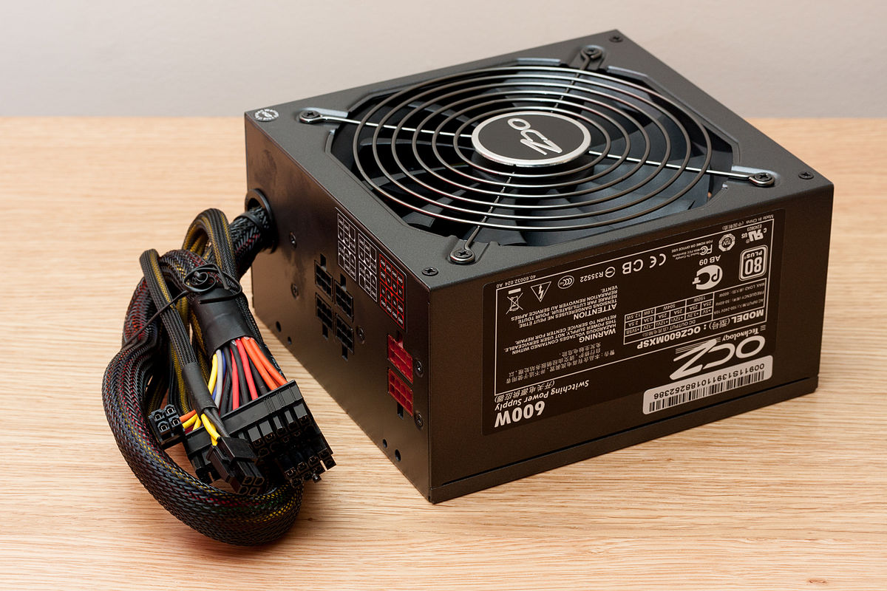
*Source: https://commons.wikimedia.org/wiki/File:OCZ_600W_power_supply_unit.JPG*

### Composantes électroniques de la carte-mère
Les circuits de la carte-mère sont très sensibles et le courant fourni par le bloc d'alimentation n'est pas toujours "propre" ni exactement conforme aux besoins de ces micro-circuits. Ainsi, la carte comprend des éléments qui servent à filtrer et régulariser le courant qu'elle distribue. Ces éléments sont de 4 types principalement:

| Pièce | Rôle | 
| ----- | ---- | 
| [Condensateur](https://www.youtube.com/watch?v=MUrG2sFIjYo) | Permet d'accumuler et régulariser le courant électrique |
| Bobine d'arrêt ("Choke") | Filtrer le courant électrique |
| [Inducteur](https://www.youtube.com/watch?v=16TAJREID_0&list=PLvX5VVNKso909CphZeV2iP8Jp5rgt2-jV&index=3) | Attenuer le courant électrique |
| MOSFET | *Metal Oxide Semiconductor Field Effect Transistor*, usages divers |

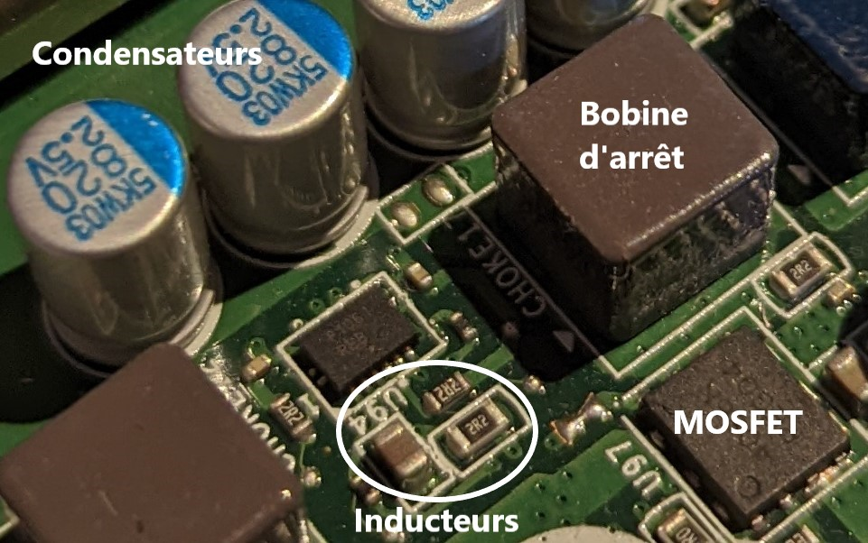

#### Chipset
Ensemble de composantes électroniques interreliées permettant de contrôler l'échange de données entre les périphériques. L'architecture du *chipset* est dépendante de celle du CPU: donc lorsqu'on souhaite changer le CPU il est essentiel que celui-ci soit compatible avec le *chipset* de la carte.

*Source: https://commons.wikimedia.org/wiki/File:Motherboard_diagram.svg*

Traditionnellement, le *chipset* est divisé en 2 parties : *Northbridge* et *Southbridge*:
+ **Northbridge :** Circuits permettant la communication entre le CPU, la RAM, la carte graphique ou tout autre périphérique qui nécessite des performances élevées. 
+ **Southbridge :** Gère les communications entre Northbridge et les périphériques de performance moindre (USB, disques et réseau notamment).
Depuis quelques années cependant, la plupart des fonctions de Northbridge sont incluses dans le CPU lui-même

#### Socket et CPU
Le CPU (*Central Processing Unit*) est le processeur principal du PC: il est chargé d'exécuter les instructions qui sont lancées par chacun des programmes qui roulent sur le PC. Sur la carte-mère, le *socket* est le boîtier qui permet de maintenir le CPU en place. Il relie chacun des points de contacts du CPU avec les points correspondants sur la carte-mère. Chaque *socket* est donc conçu spécifiquement pour certains types de CPU; la compatibilité entre les deux est essentielle.

Attention, tous les processeurs d'une même génération ne sont pas nécessairement compatibles à un même *socket*: c'est plutôt la fréquence (en MHz) qui est déterminante. Quelques exemples:

| Socket | Modèle de CPU | Plage de fréquences |
| ------ | ------------- | ------------------- |
| 1700 | Intel Socket Support pour  la 14ième, 13ième et 12ième génération; Intel Core Pentium Gold; Celeron Processeur | Max 3,4 GHz |
| 1366 | Intel Core i7; Intel Core i7 Extreme Edition; Intel Xeon | 2400 - 3200 MHz |
| 1156 | Intel Celeron Dual-Core; Intel Core i3; Intel Core i5; Intel Core i7; Intel Pentium Dual-Core; Intel Xeon | 1867 - 3600 MHz |
| AM4 | AMD A6, A8, A10 et A12 AMD Ryzen (tous) | 2800 - 4000 MHz |

Plus d'informations: https://www.cpu-world.com/Sockets/index.html

#### RAM 
La RAM (*Random Access Memory*) permet de stocker les instructions des programmes qui s'exécutent sur le PC et les données que ces programmes utilisent. Elle correspond à la capacité de traitement des informations d'un PC: ce qui ne peut pas être mis en RAM faute de place devra être écrit sur le disque, et les opérations de lecture et écriture sur disque sont beaucoup plus lentes que celles dans la RAM. Ainsi, elle a un impact important sur les performances d'un PC.

La plupart des PC actuels utilisent des modules de mémoire *DIMM* (*Dual Inline Memory Module*) dont la taille (comptée en "pins", qui est le nombre de points de contacts électroniques qu'elle contient) peut varier de 100 à 288 pins selon le type. Il existe aussi des modules SO-DIMM (260 pins) ou encore Micro-DIMM (172 pins, DDR2 seulement), qui sont plus petits que des modules DIMM habituels et sont utilisés dans des ordinateurs portables principalement.

La technologie utilisée pour transférer les données entre la carte-mère et le module de mémoire définit le type de la RAM. Aujourd'hui, le type le plus répandu est DDR4. Le plus performant et (bientôt) le plus répandu est DDR5.

Le dernier paramètre de la mémoire RAM est sa **fréquence**, qui se mesure en *MHz*. Ce nombre désigne le nombre d'opérations de lecture ou d'écriture à la seconde que la mémoire peut supporter (2600 MHz = 2,6 milliards d'opérations/seconde); mais attention, la limite de la carte-mère est déterminante: si celle-ci est limitée à 2133 MHz, un module de RAM de 2600 MHz sera limité à 2133 MHz.

La carte-mère définit aussi la limite de quantité de données qu'elle peut supporter: si la carte-mère est limitée à 32 Go de RAM, il est inutile d'ajouter de la RAM au-delà de 32 Go.

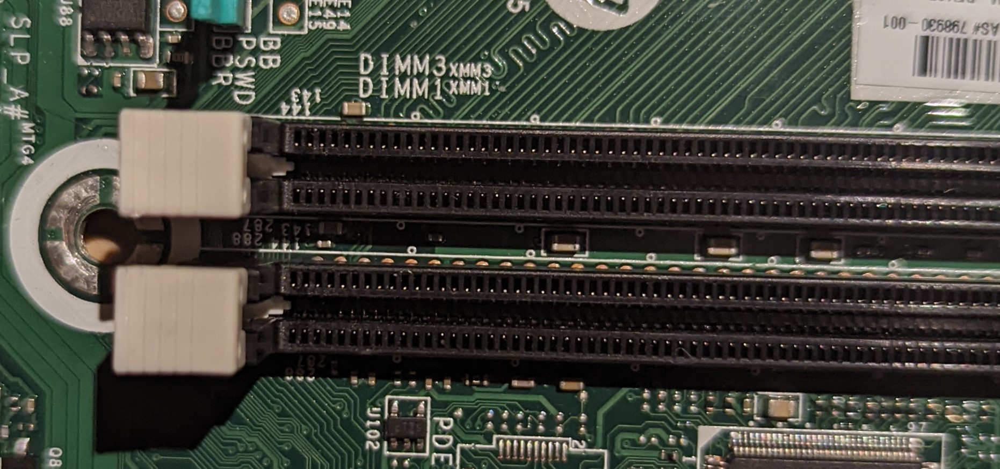

### Ports 
#### PCI-Express
Les ports PCI (*Peripheral Component Interconnect*) sont des ports génériques qui servent à connecter différents types de périphériques. *PCI-Express* (ou PCIe) est une version évoluée de PCI, plus rapide et plus récente.

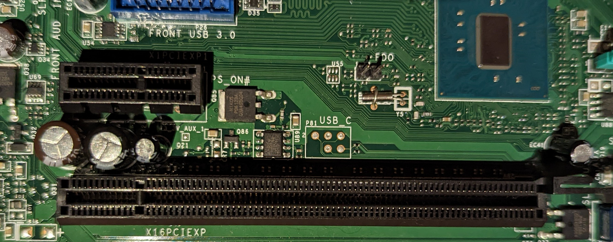

Étant donné que les périphériques PCIe peuvent être de nombreux types (cartes graphiques, interfaces réseau ou wifi, stockage NVMe), la quantité de données transmis par ces ports peuvent être variable, et donc leurs tailles peuvent être différentes. Il y a 4 tailles possibles: x1, x4, x8 et x16. Le standard PCIe permet cependant que des périphériques de petite taille soient utilisés dans les ports de taille plus grande.

<!-- 
*source: https://www.frandroid.com/guide-dachat/guides-dachat-hardware/833340_ssd-m-2-nvme* -->

#### Ports SATA
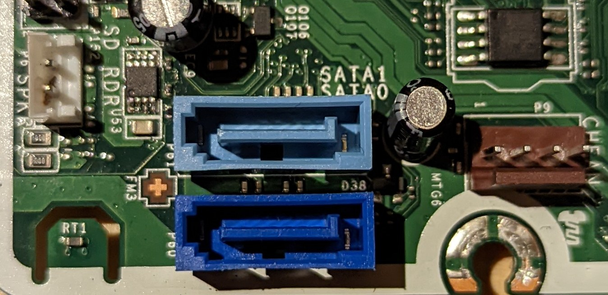

La norme SATA (*Serial AT Attachment*) est utilisée pour connecter des périphériques de stockage (disques et lecteurs DVD). Quoique très répandue, elle est relativement ancienne car elle date du début des années 2000, mais elle est le standard pour les disques durs à plateau. Dans le cas des disques "SSD", le norme NVMe tend à la remplacer car elle permet de meilleures performances.

Il peut y avoir plusieurs ports SATA sur une carte-mère. En général, on doit brancher le disque de démarrage sur le port SATA 0; mais il est possible de contourner cette obligation grâce à un paramètre de configuration dans le BIOS.

#### Connecteurs USB
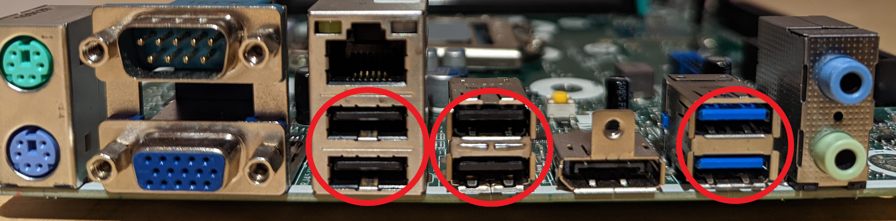

Les ports USB (*Universal Serial Bus*), bien connus, servent à connecter une foule de périphériques différents. Leur utilité vient du fait qu'ils se configurent automatiquement, que les périphériques sont reconnus au moment de leur branchement (pas besoin de redémarrer le PC) et qu'ils permettent de transmettre du courant électrique de faible intensité.

La norme USB a beaucoup évolé depuis sa création: en conséquence il existe plusieurs types de connecteurs et de vitesses de transfert. Par exemple, entre USB-2 et USB-3, les taux de transferts sont passés de 480 Mbps à 5 Gbps (puis à 40 Gbps avec USB-4). Afin de distinguer les ports rapides des ports lents, on donne la couleur bleue aux ports USB-3.

Les nouveaux ordinateurs tendent à livrer également un ou plusieurs connecteur USB-c. Ce type est réversible. Il peut être connecté dans le sens inverse contrairement aux ports USB traditionnels.

<!-- #### Ports PS/2
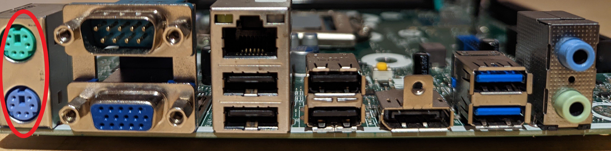
Cette norme remonte au milieu des années 1980: elle était utilisée pour connecter les claviers et les souris avant l'invention de USB.

#### Port VGA
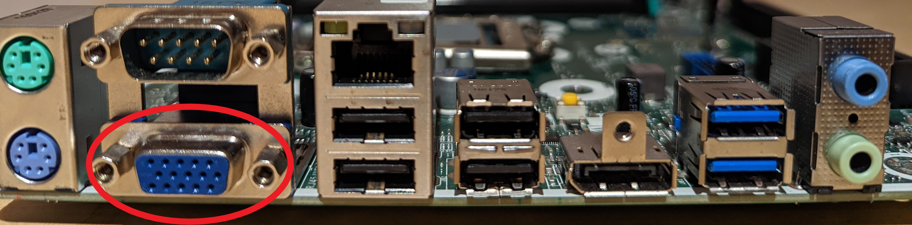
Utilisée pour connecter les moniteurs avant l'apparition des connecteurs DVI.

#### Port série
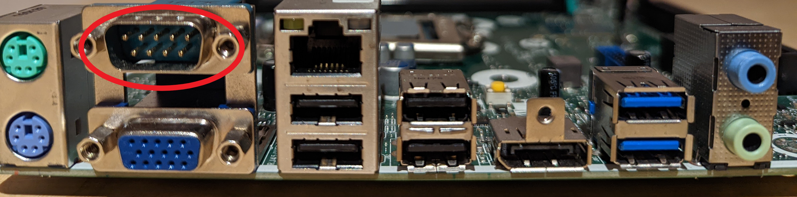
Le port série (ici la spécification DE-9) est très ancien: il a initialement été conçu dans les années 1950! On le retrouve sur certaines cartes-mère car, malgré qu'il n'est pratiquement plus utilisé dans des périphériques grand public, il est très simple à utiliser et en conséquence peut être très utile pour des périphériques faits sur mesure, des prototypes, etc. On le retrouve aussi dans certaines composantes de réseaux informatiques comme des routeurs ou des commutateurs. -->

### Autres composantes

#### Cavaliers ("jumpers")
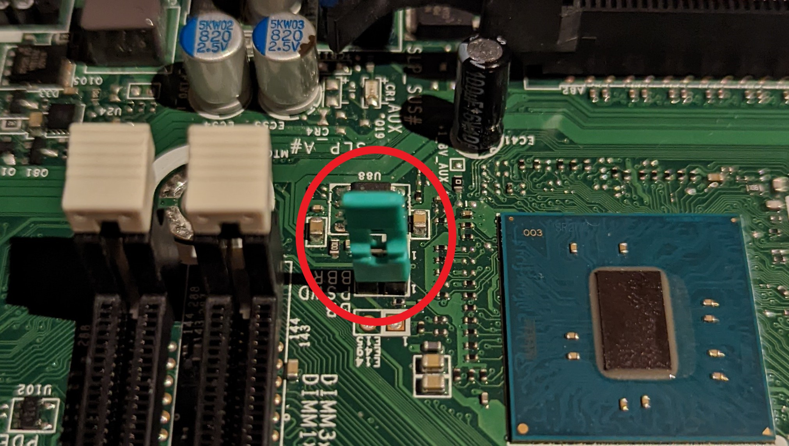

Les cavaliers sont des pièces amovibles de la carte-mère qui servent à connecter deux tiges de métal. On les utilise pour modifier des paramètres de configuration de la carte.

#### Interrupteur CMOS
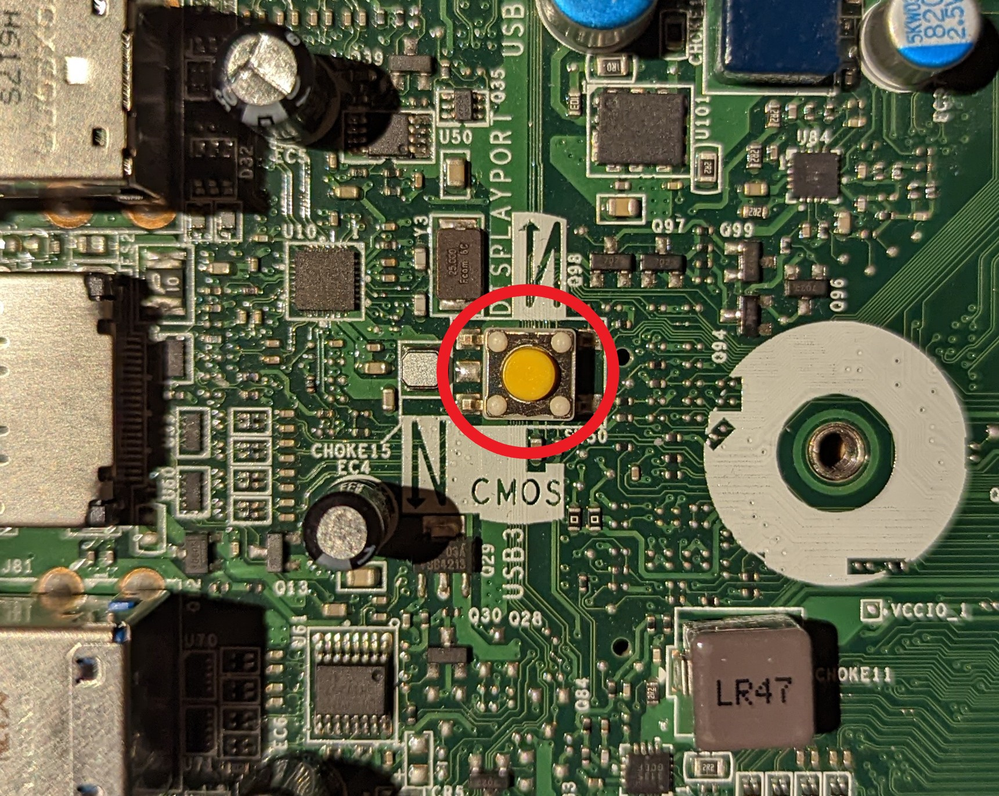

Bouton utilisé pour réinitialiser la configuration du BIOS.

#### Pile
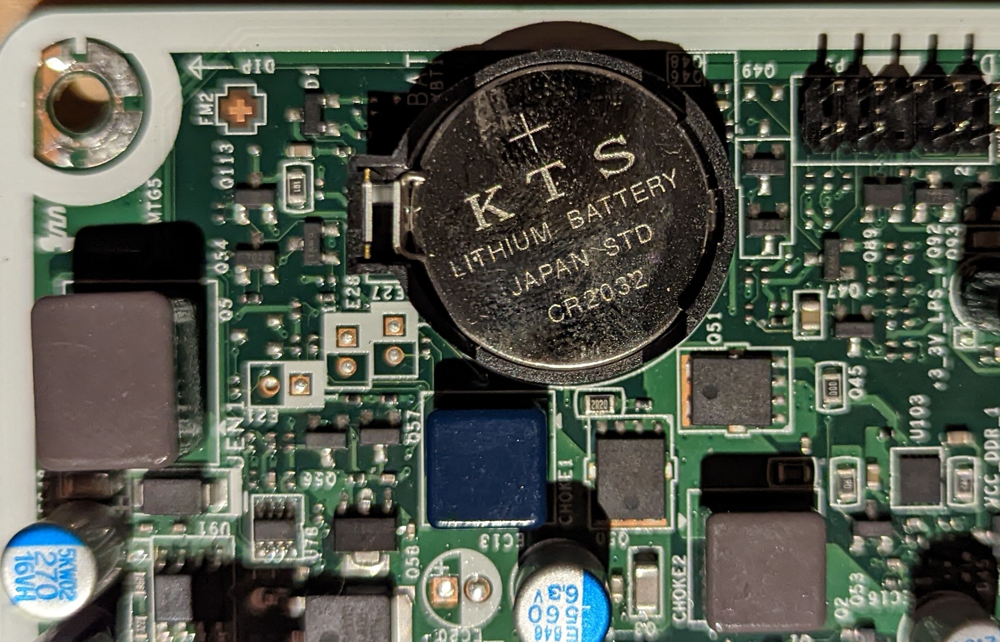

La pile permet au PC de recevoir un minimum d'alimentation lorsqu'il est éteint ou débranché. Ceci lui permet de conserver son horloge interne et les données de configuration du BIOS. Donc, enlever la pile a pour effet de réinitialiser entièrement les paramètres du BIOS.

<!-- ### Pnp (Plug and Play)
Le plug and play (l'abréviation PnP est également utilisée), qui signifie « connecter et jouer » ou « brancher et utiliser », est une technique permettant aux [systèmes d'exploitation](https://fr.wikipedia.org/wiki/Syst%C3%A8me_d%27exploitation) qui l'intègrent de reconnaître rapidement et automatiquement les périphériques compatibles avec cette technique dès le branchement, sans redémarrage de l'ordinateur.

Source: https://en.wikipedia.org/wiki/Plug_and_play -->

