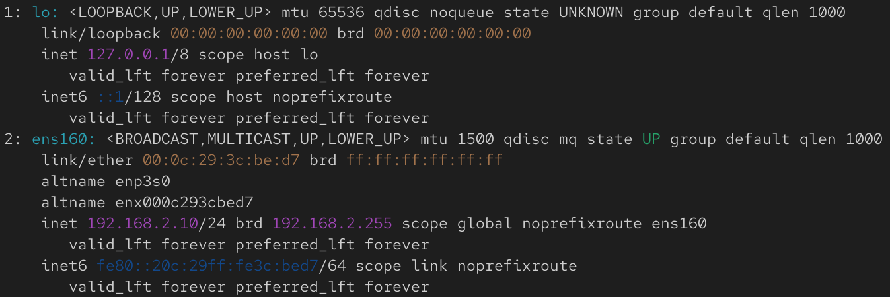

+++
pre = '<b>10. </b>'
title = "Réseau"
weight = "900"
+++
---------------------

Dans ce chapitre, nous allons découvrir les **outils réseau essentiels** disponibles sur une machine Linux. Ces commandes permettent de diagnostiquer l’état du réseau, d’inspecter les connexions ouvertes, de tester la connectivité et d’accéder à une machine distante.
<!-- Avant de manipuler des services ou d’établir des connexions distantes, il est crucial de savoir **comment une machine est configurée sur le réseau** : adresses IP, interfaces actives, routes, etc. -->

### La commande `ip`

La commande `ip` permet d'afficher ou des modifier certains paramètres réseau d'une machine linux. Dans ce cours, nous allons voir deux façons de l'utiliser (mais il en existe beaucoup plus) : 

#### `ip a`
`ip a`, ou `ip address` permet d'afficher l’ensemble des interfaces réseau et leurs paramètres. 

Elle permet notamment de visualiser :

+ Les interfaces disponibles (ex. `eth0`, `ens160`, `lo` pour loopback).
+ L'adresse IP (champ `inet`) : Elle se compose de 4 nombres pouvant aller de 0 à 255.
+ L’état de l’interface (`UP` / `DOWN`)
+ L'adresse MAC (champ `link/ether`) : Une adresse qui se compose de 6 paires de nombres héxadécimaux. Cette adresse est unique à chaque interface ou carte réseau.

{} 
La commande équivalente sur Windows est :
```powershell
ipconfig /all
```
{} 

Exemple : 



Dans cet exemple : 
+ La deuxième interface réseau s'appelle : `ens160`
+ Son état est **UP** (active)
+ Son adresse MAC est : `00:0c:29:3c:be:d7`
+ Son adresse IP : `192.168.2.10`

### `ip route`
La commande `ip route` permet d’afficher ce que l’on appelle **la table de routage**, c’est-à-dire les règles que la machine utilise pour décider par où envoyer les paquets réseau lorsqu’elle essaie de communiquer avec d’autres machines.

{}
On peut voir cela comme un petit “GPS interne” du système :
Quand l’ordinateur veut joindre une adresse, il regarde cette table pour savoir quelle sortie utiliser.
{}

Exemple de sortie :
```nginx
default via 192.168.1.1 dev ens33
192.168.1.0/24 dev ens33 proto kernel scope link src 192.168.1.20
```

La première ligne de cet exemple indique la règle la plus importante : **la passerelle par défaut**.

La passerelle par défaut est la porte de sortie du réseau: lorsque vous ouvrez une connexion sur un serveur qui se trouve sur internet (par exemple www.google.com), la communication entre votre PC et ce serveur passe par
cette passerelle.

## Tester la connectivité : `ping`
`ping` permet de vérifier si la communication avec une autre machine est possible. Par exemple, la commande suivante vérifie s'il est possible de communiquer avec le serveur Web de Google :

```bash
ping www.google.com
```

{}
+ `ping` envoie un paquet et affiche le temps de réponse. 
+ Pour les "gamers" : vous savez sans doute que le `ping` est souvent utilisé pour évaluer la qualité d'une connexion à un serveur de jeu.
{} 


Par défaut, lorsqu'on lance la commande, on envoie des requêtes à l'infini. Nous pouvons interrompre le processus avec un simple `Ctrl + C`. 

Une autre option serait de spécifier le nombre de requêtes à faire avec l'option `-c`. L'exemple ci-dessous montre comment envoyer 5 requêtes `ping` à www.google.com :  

```bash
ping -c 5 www.google.com
```

Il est aussi possible d'utiliser l'option `-n` pour afficher les adresses IP au lieu des noms d'hôte.

<!-- 
Exemples utiles à montrer :

ping google.com
ping <ip_de_votre_vm> -->

## Processus vs services vs port
Dans un système d’exploitation, les notions de **services**, **ports** et de **processus** sont étroitement liées : 

1. Les **processus** (comme vu dans le chapitre précédent), est simplement un programme en cours d’exécution.
2. Un **service** (ou *daemon*) est un processus conçu pour **fonctionner en tâche de fond** et **offrir une fonctionnalité système ou réseau**. Voici quelques exemples de services  :

    + `sshd` → fournit un accès distant sécurisé (**SSH**)
    + `nginx` → sert des pages web
    + `mysqld` → gère une base de données

3. Lorsqu’un service utilise le réseau, il doit utiliser un **port** : C'est un numéro permettant au système d’identifier à quel service doit être envoyée une connexion ou une donnée lorsqu'elle arrive au PC via le réseau.

### Identifier les ports et connexions : `lsof`

`lsof` (*List Open Files*) est un outil puissant qui permet, entre autres, de lister les processus/services utilisant un port. Il s'utilise généralement de façon suivante : 

```bash
sudo lsof -i
```

Cette commande est très utile pour diagnostiquer :
+ "Quel service utilise le port 22 ?"
+ "Quel programme bloque l'utilisation de ce port ?"

Exemple de résultat : 
```nginx
sshd     742   root    3u  IPv4  25028  0t0  TCP *:22 (LISTEN)
```

Cette commande affiche :
+ **Nom du processus/service :** `sshd`
+ **PID :** `742`
+ **Protocole réseau utilisé :** `TCP`
+ **Port utilisé :** `22`
+ **Utilisateur** : `root`

<!-- Il est aussi possible de filtrer par port ou protocole réseau
```bash
sudo lsof -i TCP
sudo lsof -i :22
``` -->


## Connexion à une machine : `ssh`
`ssh` (*Secure Shell*) est l’outil standard pour se connecter à une machine distante de manière sécurisée.

Pour se connecter à une VM distante :
```bash
ssh utilisateur@adresse_ip
```

{}
Pour pouvoir se connecter à une VM en utilisant SSH, il est nécessaire d'avoir le service `sshd` installé et actif sur la VM: 
```bash
sudo apt install openssh-server # pour l'installer
sudo systemctl status sshd # pour vérifier qu'il est actif
```
{}

### Copie de fichier dans une machine distante : `scp`
`scp` (Secure Copy) permet de copier un fichier sur une machine distante en utilisant **SSH**. `scp` s'utilise de la façon suivante: 
```bash
scp <chemin du fichier à copier> utilisateur@ip:/chemin/de/destination
```


